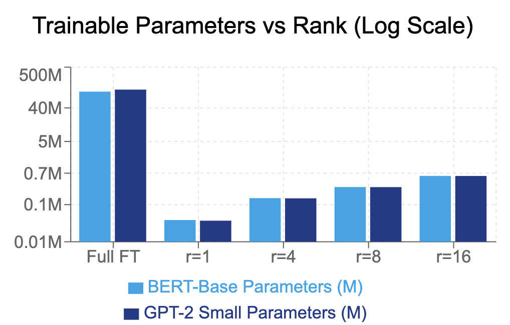
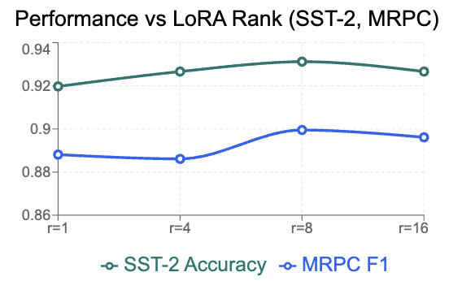
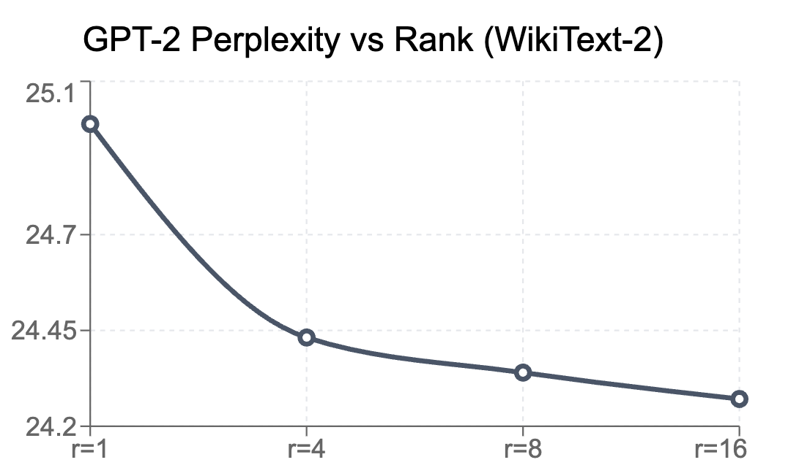

# CS 4782 Final Project: Reimplementing LoRA

## 1. Introduction

This repo is our from-scratch reimplementation of [LoRA: Low-Rank Adaptation of Large Language Models](https://arxiv.org/abs/2106.09685) (Hu et al., ICLR 2022) for CS 4782 at Cornell.

The main idea behind LoRA is that when you fine-tune a large pretrained model, the weight updates actually live in a low-rank subspace. So instead of updating all the weights, you can inject small low-rank matrices and only train those — getting similar performance with way fewer trainable parameters.

## 2. Chosen Result

We aimed to reproduce **Table 2** and **Table 4** from the LoRA paper, which show that LoRA matches or beats full fine-tuning on GLUE benchmarks (using BERT/RoBERTa) and language modeling (using GPT-2), while training less than 1% of the parameters.

Specifically, we targeted:
- **GLUE classification** (SST-2 accuracy, MRPC F1) with BERT-base — comparing full fine-tuning vs. LoRA at ranks r ∈ {1, 4, 8, 16}
- **WikiText-2 perplexity** with GPT-2 Small — same comparison

These results are the core evidence for the paper's claim that low-rank adaptation is a viable alternative to full fine-tuning.

## 3. GitHub Contents

```
README.md              ← you are here
code/
  lora/                ← our LoRA implementation (layers.py, inject.py)
  train_glue.py        ← BERT fine-tuning on SST-2/MRPC
  train_wikitext2.py   ← GPT-2 fine-tuning on WikiText-2
  plot_results.py      ← figure generation
notebooks/             ← Colab notebooks (recommended way to run)
results/               ← experiment outputs and figures
report/                ← final 2-page report (.tex + .pdf)
poster/                ← poster PDF
scripts/               ← shell scripts for batch runs
data/                  ← dataset info (auto-downloaded at runtime)
LICENSE                ← MIT License
requirements.txt       ← Python dependencies
```

## 4. Re-implementation Details

**What we built:** We wrote LoRA from scratch — no PEFT, no adapter libraries. Our implementation consists of:

- `LoRALinear` and `LoRAConv1D` wrapper modules that freeze the original weight and add trainable low-rank matrices A and B
- An injection function that walks the model graph and swaps target layers for their LoRA-wrapped versions
- A freezing function that ensures only LoRA parameters (and the task head) are trainable

**Models & Datasets:**
- **BERT-base** (110M params) on SST-2 (sentiment, 67K examples) and MRPC (paraphrase, 3.7K examples)
- **GPT-2 Small** (124M params) on WikiText-2 (language modeling, ~2M tokens)

**Key hyperparameters:** LoRA rank r ∈ {1, 4, 8, 16}, α = 16 (BERT) / 32 (GPT-2), dropout = 0.1, target modules = query+value (BERT) / c_attn (GPT-2)

**Challenges:** The original paper uses RoBERTa-base, but we used BERT-base since it's more accessible. We also had to handle GPT-2's non-standard `Conv1D` layer format (transposed weights compared to `nn.Linear`). Full fine-tuning on small GLUE datasets led to significant overfitting, which we discuss in our results.

## 5. Reproduction Steps

### Requirements
- Python 3.8+
- PyTorch, Transformers, Datasets (see `requirements.txt`)
- GPU recommended (we used a A100 on Google Colab)

### Option A: Colab (easiest)

1. Open `notebooks/lora_project_colab_full.ipynb` in Google Colab
2. Run all cells top-to-bottom
3. Results + figures get auto-exported as a zip

### Option B: Local

```bash
# Setup
python3 -m venv .venv && source .venv/bin/activate
pip install -r requirements.txt

# Run BERT on SST-2 with LoRA (r=8)
python code/train_glue.py \
  --task_name sst2 --mode lora \
  --lora_rank 8 --lora_alpha 16 \
  --lora_targets query,value \
  --output_dir results/glue

# Run GPT-2 on WikiText-2 with LoRA (r=8)
python code/train_wikitext2.py \
  --mode lora \
  --lora_rank 8 --lora_alpha 16 \
  --lora_targets c_attn \
  --output_dir results/wikitext2

# Full fine-tuning baseline (for comparison)
python code/train_glue.py --task_name sst2 --mode full --output_dir results/glue
python code/train_wikitext2.py --mode full --output_dir results/wikitext2
```

### Option C: Run everything at once

```bash
chmod +x scripts/run_everything.sh
./scripts/run_everything.sh
```

Each run produces a `summary.json` with all metrics, param counts, GPU memory usage, and per-epoch training history.

## 6. Results and Insights

### Main Results

| Task | Method | Trainable Params | Best Metric |
|------|--------|-----------------|-------------|
| SST-2 | Full FT | 109.5M (100%) | 85.3% acc |
| SST-2 | LoRA r=1 | 38K (0.04%) | 92.0% acc |
| SST-2 | LoRA r=4 | 149K (0.14%) | 92.7% acc |
| SST-2 | **LoRA r=8** | **296K (0.27%)** | **93.1% acc** |
| SST-2 | LoRA r=16 | 591K (0.54%) | 92.7% acc |
| MRPC | Full FT | 109.5M (100%) | 82.6% F1 |
| MRPC | **LoRA r=8** | **296K (0.27%)** | **89.9% F1** |
| WikiText-2 | Full FT | 124.4M (100%) | **23.60 ppl** |
| WikiText-2 | LoRA r=16 | 590K (0.47%) | 24.27 ppl |

### Figures

| | |
|---|---|
|  |  |
|  | |

### Key Takeaways

- **LoRA beats full fine-tuning on GLUE** — SST-2: 93.1% vs 85.3%, MRPC: 89.9% vs 82.6% F1. Full FT likely overfits on these small datasets since it's updating all 109.5M params without enough regularization.
- **Competitive on language modeling** — LoRA (r=16) gets 24.27 ppl vs 23.60 for full FT on WikiText-2. Only 0.67 ppl gap with 99.5% fewer trainable params.
- **Rank saturates around r=8** — going from r=8 to r=16 doesn't help (and sometimes hurts), supporting the paper's low-rank hypothesis.
- **58% GPU memory savings** — LoRA uses ~0.87 GB vs 2.09 GB for full FT on SST-2 because you only store gradients for the tiny adapter matrices.

## 7. Conclusion

Our reimplementation confirms that LoRA works — task-specific weight updates really do live in a low-rank subspace, and you can get away with training a tiny fraction of the parameters. The fact that even r=1 (38K params) beats full fine-tuning on GLUE is pretty remarkable and suggests these classification tasks need very few degrees of freedom on top of a good pretrained model.

The biggest lesson was seeing how full fine-tuning can actually *hurt* on small datasets due to overfitting, while LoRA's constrained parameter space acts as a natural regularizer. On larger datasets like WikiText-2, full FT does win, but the gap is small.

If we had more time, we'd try QLoRA (LoRA + 4-bit quantization), apply LoRA to MLP layers too, and run multiple seeds for proper variance estimates.

## 8. References

1. Hu, E. J., Shen, Y., Wallis, P., Allen-Zhu, Z., Li, Y., Wang, S., Wang, L., & Chen, W. (2022). [LoRA: Low-Rank Adaptation of Large Language Models](https://arxiv.org/abs/2106.09685). *ICLR 2022*.
2. Devlin, J., Chang, M., Lee, K., & Toutanova, K. (2019). [BERT: Pre-training of Deep Bidirectional Transformers for Language Understanding](https://arxiv.org/abs/1810.04805). *NAACL-HLT 2019*.
3. Radford, A., Wu, J., Child, R., Luan, D., Amodei, D., & Sutskever, I. (2019). [Language Models are Unsupervised Multitask Learners](https://cdn.openai.com/better-language-models/language_models_are_unsupervised_multitask_learners.pdf). *OpenAI*.
4. Houlsby, N., Giurgiu, A., Jastrzebski, S., Morber, B., Larochelle, H., Gesmundo, A., Attariyan, M., & Gelly, S. (2019). [Parameter-Efficient Transfer Learning for NLP](https://arxiv.org/abs/1902.00751). *ICML 2019*.

## 9. Acknowledgements

This project was completed as part of **CS 4782: Introduction to Deep Learning** at Cornell University, SP 2026, taught by the CS 4782 course staff. We'd like to thank the course instructors and TAs for their feedback during the poster session and throughout the project.

Our implementation was trained on Google Colab using pro-tier A100 GPUs. We used HuggingFace Transformers and Datasets for base models and data loading, with LoRA implemented entirely from scratch.

**Team:** Rohan Shankar (rs2656) & Harshaan Chugh (hsc53)
